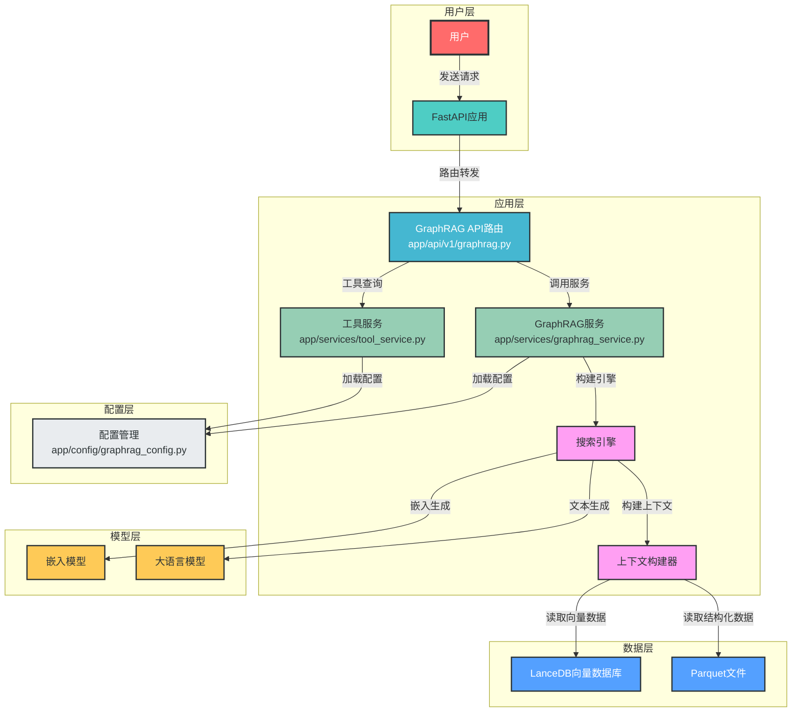
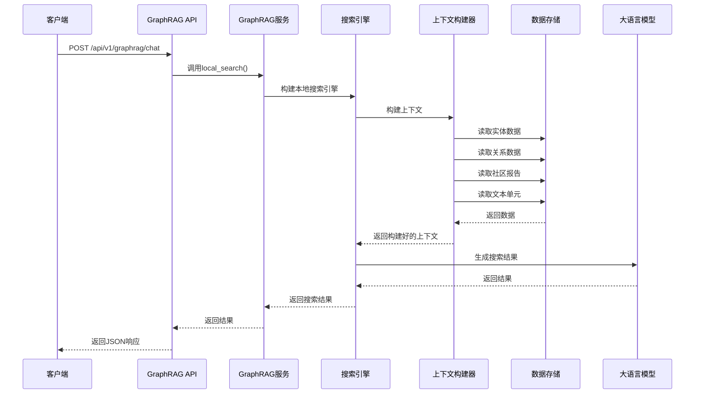
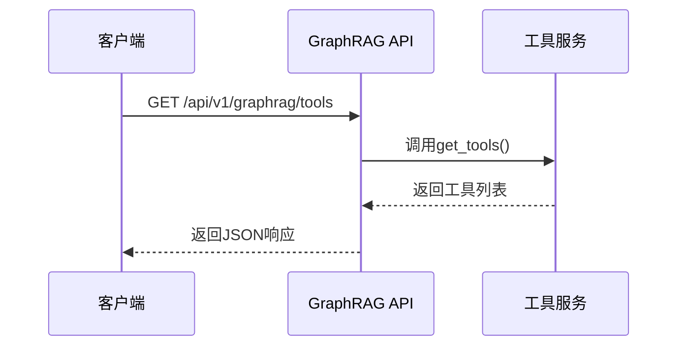

# GraphRAG+MCP+RAG功能集成方案

## 1. 模块划分和接口定义

### 1.1 模块划分

| 模块名称 | 功能描述 | 文件路径 | 依赖关系 |
|---------|---------|---------|---------|
| GraphRAG服务 | 核心搜索功能封装 | `app/services/graphrag_service.py` | graphrag, lancedb, pandas |
| GraphRAG API路由 | API接口定义 | `app/api/v1/graphrag.py` | fastapi, graphrag_service |
| 配置管理 | 集成配置 | `app/config/graphrag_config.py` | pydantic |
| 工具管理 | 工具查询和管理 | `app/services/tool_service.py` | - |

### 1.2 接口定义

#### 1.2.1 Chat接口

**路径**: `/api/v1/graphrag/chat`
**方法**: POST
**请求体**:
```json
{
  "query": "萧炎的父亲是谁?"
}
```
**响应体**:
```json
{
  "tool_info": {
    "name": "local_asearch",
    "description": "为斗破苍穹小说提供相关的知识补充"
  },
  "result": "萧炎的父亲是萧战，他是萧家的族长..."
}
```

#### 1.2.2 工具查询接口

**路径**: `/api/v1/graphrag/tools`
**方法**: GET
**响应体**:
```json
{
  "tools": [
    {
      "name": "local_asearch",
      "description": "为斗破苍穹小说提供相关的知识补充",
      "parameters": {
        "query": {
          "type": "string",
          "description": "查询字符串"
        }
      }
    }
  ]
}
```

## 2. 核心组件的实现方式

### 2.1 GraphRAG服务封装

将GraphRAG的核心功能封装为服务类，提供同步和异步接口：

```python
# app/services/graphrag_service.py
from typing import List, Dict, Any
from graphrag.query.structured_search.base import SearchResult
from .graphrag_server import (  # 复用原有代码
    build_local_search_engine,
    build_global_search_engine,
    build_drift_search_engine
)

class GraphRAGService:
    """GraphRAG服务类，封装核心搜索功能"""
    
    def __init__(self):
        """初始化GraphRAG服务"""
        self.local_search_engine = None
        self.global_search_engine = None
        self.drift_search_engine = None
    
    async def local_search(self, query: str) -> str:
        """本地搜索接口"""
        if not self.local_search_engine:
            self.local_search_engine = build_local_search_engine()
        result = await self.local_search_engine.asearch(query)
        return result.response
    
    async def global_search(self, query: str) -> str:
        """全局搜索接口"""
        if not self.global_search_engine:
            self.global_search_engine = build_global_search_engine()
        result = await self.global_search_engine.asearch(query)
        return result.response
    
    async def drift_search(self, query: str) -> str:
        """DRIFT搜索接口"""
        if not self.drift_search_engine:
            self.drift_search_engine = build_drift_search_engine()
        result = await self.drift_search_engine.asearch(query)
        return result.response
```

### 2.2 API路由实现

```python
# app/api/v1/graphrag.py
from fastapi import APIRouter, Depends, HTTPException
from pydantic import BaseModel
from app.services.graphrag_service import GraphRAGService
from app.services.tool_service import ToolService

api_router = APIRouter()

# 依赖注入
def get_graphrag_service():
    return GraphRAGService()

def get_tool_service():
    return ToolService()

# 请求模型
class ChatRequest(BaseModel):
    query: str

# 响应模型
class ToolInfo(BaseModel):
    name: str
    description: str

class ChatResponse(BaseModel):
    tool_info: ToolInfo
    result: str

class ToolParameter(BaseModel):
    type: str
    description: str

class ToolDetail(BaseModel):
    name: str
    description: str
    parameters: Dict[str, ToolParameter]

class ToolsResponse(BaseModel):
    tools: List[ToolDetail]

@api_router.post("/chat", response_model=ChatResponse)
async def chat(
    request: ChatRequest,
    graphrag_service: GraphRAGService = Depends(get_graphrag_service)
):
    """聊天接口，接受查询并返回结果"""
    try:
        result = await graphrag_service.local_search(request.query)
        return ChatResponse(
            tool_info=ToolInfo(
                name="local_asearch",
                description="为斗破苍穹小说提供相关的知识补充"
            ),
            result=result
        )
    except Exception as e:
        raise HTTPException(status_code=500, detail=str(e))

@api_router.get("/tools", response_model=ToolsResponse)
async def get_tools(
    tool_service: ToolService = Depends(get_tool_service)
):
    """获取支持的工具列表"""
    return ToolsResponse(tools=tool_service.get_tools())
```

### 2.3 工具服务实现

```python
# app/services/tool_service.py
from typing import List, Dict, Any
from .tool_info import ToolDetail, ToolParameter

class ToolService:
    """工具服务类，管理支持的工具"""
    
    def __init__(self):
        """初始化工具服务"""
        self.tools = {
            "local_asearch": {
                "description": "为斗破苍穹小说提供相关的知识补充",
                "parameters": {
                    "query": {
                        "type": "string",
                        "description": "查询字符串"
                    }
                }
            }
        }
    
    def get_tools(self) -> List[Dict[str, Any]]:
        """获取所有支持的工具"""
        tool_list = []
        for tool_name, tool_info in self.tools.items():
            tool_list.append({
                "name": tool_name,
                "description": tool_info["description"],
                "parameters": tool_info["parameters"]
            })
        return tool_list
    
    def get_tool(self, tool_name: str) -> Dict[str, Any]:
        """获取指定工具的信息"""
        if tool_name not in self.tools:
            raise ValueError(f"Tool {tool_name} not found")
        return self.tools[tool_name]
```

### 2.4 配置管理

```python
# app/config/graphrag_config.py
from pydantic_settings import BaseSettings
from typing import Optional

class GraphRAGConfig(BaseSettings):
    """GraphRAG配置"""
    # 数据目录
    DATA_DIR: str = "design_docs/mcp_rag_agent_graphrag_demo/doupocangqiong/output"
    # LanceDB URI
    LANCEDB_URI: str = "design_docs/mcp_rag_agent_graphrag_demo/doupocangqiong/output/lancedb"
    # 社区级别
    COMMUNITY_LEVEL: int = 2
    # API配置
    API_KEY: Optional[str] = None
    BASE_URL: Optional[str] = None
    MODEL: str = "qwen-turbo"
    
    class Config:
        env_file = ".env"
        env_file_encoding = "utf-8"
```

## 3. 架构流程图



## 4. 数据流和控制流

### 4.1 聊天请求处理流程



### 4.2 工具查询流程



## 5. 集成说明文档

### 5.1 环境准备

1. **安装依赖**: 
   ```bash
   uv add graphrag lancedb pandas tiktoken python-dotenv mcp
   ```

2. **配置环境变量**: 
   在项目根目录的`.env`文件中添加以下配置:
   ```env
   # GraphRAG配置
   API_KEY=your_api_key
   BASE_URL=your_api_base
   MODEL=qwen-turbo
   ```

### 5.2 代码集成

1. **添加GraphRAG API路由到主路由**: 
   ```python
   # app/api/v1/__init__.py
   from fastapi import APIRouter
   from app.api.v1 import auth, users, graphrag
   
   api_v1_router = APIRouter()
   api_v1_router.include_router(auth.router, prefix="/auth", tags=["auth"])
   api_v1_router.include_router(users.router, prefix="/users", tags=["users"])
   api_v1_router.include_router(graphrag.api_router, prefix="/graphrag", tags=["graphrag"])
   ```

2. **配置管理集成**: 
   ```python
   # app/dependencies/config.py
   from app.config.graphrag_config import GraphRAGConfig
   
   # 添加到配置依赖中
   graphrag_config = GraphRAGConfig()
   ```

### 5.3 测试验证

1. **启动应用**: 
   ```bash
   python main.py
   ```

2. **访问API文档**: 
   - Swagger UI: http://localhost:8001/docs
   - ReDoc: http://localhost:8001/redoc

3. **测试Chat接口**: 
   ```bash
   curl -X POST "http://localhost:8001/api/v1/graphrag/chat" \
   -H "Content-Type: application/json" \
   -d '{"query": "萧炎的父亲是谁?"}'
   ```

4. **测试工具查询接口**: 
   ```bash
   curl -X GET "http://localhost:8001/api/v1/graphrag/tools"
   ```

### 5.4 性能优化建议

1. **搜索引擎实例缓存**: 
   考虑到搜索引擎构建成本较高，建议将搜索引擎实例缓存起来，避免每次请求都重新构建。

2. **异步处理**: 
   目前的实现已经使用了异步接口，但可以考虑进一步优化，例如使用线程池处理CPU密集型任务。

3. **数据预加载**: 
   可以在应用启动时预加载部分数据，减少请求处理时间。

4. **缓存搜索结果**: 
   对于频繁查询的内容，可以考虑添加缓存机制，提高响应速度。

### 5.5 监控与日志

1. **添加日志记录**: 
   在关键流程添加日志记录，便于监控和调试。

2. **性能监控**: 
   考虑添加性能监控，记录搜索耗时等指标。

3. **错误处理**: 
   完善错误处理机制，提供友好的错误信息。

## 6. 总结

本集成方案将GraphRAG+MCP+RAG功能成功集成到现有FastAPI项目中，实现了两个核心API接口：

1. **chat接口**: 接受字符串输入，返回工具信息和搜索结果
2. **工具查询接口**: 查询支持的工具列表

集成方案遵循了现有FastAPI项目的架构设计，采用模块化、松耦合的方式，便于维护和扩展。同时，方案考虑了性能优化、监控日志等方面，确保集成后的系统稳定可靠。

通过本方案的实施，现有FastAPI项目将获得基于GraphRAG的智能问答能力，可以为用户提供更加精准、全面的信息服务。